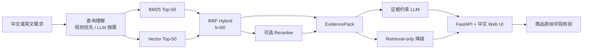

# CommerceRAG

> 一个用真实电商商品目录与人工相关性标注驱动迭代的可解释商品搜索 RAG。

[](https://github.com/zhengyang442/Commerce-RAG/actions/workflows/ci.yml)
[](https://www.python.org/)
[](CHANGELOG.md)
[](LICENSE)

CommerceRAG 不是通用聊天机器人。它聚焦一个可以量化的真实场景：用户用中文或英文描述家具需求，系统从 42,994 件真实商品中检索候选，给出受证据约束的回答，并允许通过商品接口核验引用字段。

当前公开代码已经完成 `v0.5 Stage 2` 的 Demo 产品化；在线 Demo 会在阶段三的 Mac mini 部署完成后开放。

## 为什么做这个项目

很多 RAG Demo 只展示“模型回答看起来不错”，但没有真实相关性标签，也很难判断一次升级是否有效。CommerceRAG 使用 Wayfair WANDS 数据集的 480 条查询与 233,448 条人工标注，固定数据提交、评测划分和指标口径，让每一次检索升级都能被比较。

项目保留了两类负面实验结果：

- Reranker 将 nDCG@10 从 `0.747611` 提升到 `0.759225`，但本机 P95 从 `58.255ms` 增至 `1,416.331ms`，因此只保留为实验策略。
- 30 条中文集上，全量 LLM Rewrite 的 Top-1 为 `76.67%`，低于规则优先的 `86.67%`，且 P95 约 `1.21s`，因此默认使用规则，只有仍含未翻译中文时才调用 LLM。

这两个决定体现了项目的核心原则：默认方案由质量、延迟和稳定性共同决定，而不是由组件数量决定。

## 当前能力

- 固定 WANDS commit 下载、SHA-256、行数、表头和数据契约校验。
- SQLite FTS5/BM25、FastEmbed + sqlite-vec 向量检索、RRF Hybrid 和可选 Cross-encoder Reranker。
- 规则优先、LLM 按需的中文查询理解，支持属性、否定条件和无数据意图识别。
- EvidencePack、引用校验、结构化 LLM 回答以及可靠的 `retrieval_only` 降级。
- Anthropic Messages 与 OpenAI-compatible 两种原始 HTTP 适配层。
- 中文响应式 Web UI、FastAPI API 和离线评测工具。
- 访客/开发者双模式，以及中文跨语言、多条件排除、安全拒答三个固定演示故事。
- 公网预览模式下的 Host、CORS、请求体、分级速率、每日模型额度、并发和安全响应头边界。

当前不包含价格、库存、配送、促销、售后实时数据，也不包含账号、个性化和正式高可用部署。系统不会对数据集不存在的商业信息做出承诺。

## 架构



更完整的组件与信任边界见[架构说明](docs/ARCHITECTURE.md)。

## 量化演进

以下检索结果均基于同一 WANDS commit、同一 480 条查询和 Top-10 口径：

| 版本 | 默认/实验策略 | nDCG@10 | MRR@10 | RelevantHit@10 | ExactHit@10 | 本机 P95 |
| --- | --- | ---: | ---: | ---: | ---: | ---: |
| v0.1 | BM25 | 0.666747 | 0.539732 | 0.939583 | 0.666667 | 29.548ms |
| v0.2 | Vector | 0.731349 | 0.555916 | 0.962500 | 0.679167 | 28.511ms |
| v0.3 | Hybrid（默认） | **0.747611** | **0.582816** | **0.966667** | **0.702083** | **58.255ms** |
| v0.3 实验 | Reranker | 0.759225 | 0.604684 | 0.966667 | 0.706250 | 1,416.331ms |

中文入口使用冻结的 30 条回归集：

| 模式 | Top-1 类别正确率 | Top-3 类别命中率 | 必需词覆盖 | Rewrite P95 |
| --- | ---: | ---: | ---: | ---: |
| 规则优先（默认） | **86.67%** | **96.67%** | **98.33%** | **0.102ms** |
| 全量 LLM Rewrite（实验） | 76.67% | 90.00% | 75.56% | 1,212.575ms |

完整口径、限制和复现方法见[公开评测说明](docs/EVALUATION.md)，机器可读快照见 [`benchmarks/releases/v0.4.json`](benchmarks/releases/v0.4.json)。延迟是本地 macOS ARM64 快照，不是线上 SLA。

## 快速开始

要求：macOS 或 Linux、Git、`curl`、Python 3.11+ 和 [`uv`](https://docs.astral.sh/uv/)。

```bash
git clone https://github.com/zhengyang442/Commerce-RAG.git
cd Commerce-RAG
uv sync --python 3.11 --frozen
```

下载固定版本 WANDS 数据并校验：

```bash
bash scripts/download_wands.sh
uv run python -m scripts.validate_wands
```

构建稀疏与向量索引：

```bash
uv run python -m scripts.build_index
uv run python -m scripts.build_vector_index
```

向量索引首次构建会下载约 67MB 的本地 Embedding 模型。Reranker 不是默认链路；如需复现实验，再运行：

```bash
uv run python -m scripts.download_reranker_model
```

启动本地服务：

```bash
uv run uvicorn app.main:app --host 127.0.0.1 --port 8001
```

浏览器打开：

- Web UI：<http://127.0.0.1:8001/>
- API 文档：<http://127.0.0.1:8001/docs>
- 健康检查：<http://127.0.0.1:8001/api/health>

未配置 LLM 时应用仍会正常启动，`/api/answer` 自动返回只检索结果。

页面默认面向普通访客：固定使用可用的最佳检索策略、Top-5 结果和简洁证据。展开“开发者模式”后可以选择策略和 Top-K，并查看分数、来源排名、完整字段、JSON 与分阶段耗时。

## 可选 LLM 配置

应用不会自动读取 `.env`，也不会读取 Claude Code、CC Switch 或其他工具的密钥。复制模板后必须在启动前显式加载：

```bash
cp .env.example .env
```

至少配置：

```text
RAG_LLM_API_STYLE=anthropic|openai
RAG_LLM_BASE_URL=
RAG_LLM_API_KEY=
RAG_LLM_MODEL=
```

然后启动：

```bash
set -a
source .env
set +a
uv run uvicorn app.main:app --host 127.0.0.1 --port 8001
```

OpenAI-compatible 网关必须显式设置 base URL。不要复用开发工具密钥；任何曾经出现在聊天、终端记录或第三方配置中的 Key 都应撤销后重新生成。

公网预览还支持独立的搜索/回答分钟限流，以及查询改写和回答生成共享的单进程每日真实模型调用额度。额度耗尽时继续返回检索结果，不会让核心搜索不可用。配置字段见 [`.env.example`](.env.example)。

## API

| 方法 | 路径 | 用途 |
| --- | --- | --- |
| `GET` | `/api/health` | 检查数据、BM25/Vector/Reranker 和 LLM 状态 |
| `POST` | `/api/search` | 运行 BM25、Vector、Hybrid 或 Rerank 检索 |
| `POST` | `/api/answer` | 生成证据约束回答，失败时自动退化为只检索 |
| `GET` | `/api/products/{product_id}` | 核验本地商品原始字段 |

示例：

```bash
curl --fail-with-body -sS \
  -X POST http://127.0.0.1:8001/api/search \
  -H 'Content-Type: application/json' \
  -d '{"query":"适合四个人的小型圆形餐桌","top_k":3,"retrieval_strategy":"hybrid"}'
```

## 验证与复现

不下载完整数据也可以运行轻量检查；它不会调用外部 LLM：

```bash
bash scripts/check_public.sh
```

准备完整数据和索引后运行正式评测：

```bash
uv run python -m scripts.evaluate --strategy bm25
uv run python -m scripts.evaluate --strategy vector
uv run python -m scripts.evaluate --strategy hybrid
uv run python -m scripts.evaluate --strategy rerank
uv run python -m scripts.evaluate_chinese
```

从当前评测报告重新生成公开快照：

```bash
uv run python -m scripts.export_public_benchmark
git diff --exit-code -- benchmarks/releases/v0.4.json
```

完整数据约 108MB，索引与模型缓存合计还需要数百 MB，因此 GitHub Actions 只运行轻量检查；完整 WANDS 评测是手动发布门槛。

## 文档

- [架构与信任边界](docs/ARCHITECTURE.md)
- [数据来源与治理](docs/DATASET.md)
- [公开评测与指标语义](docs/EVALUATION.md)
- [v0.1 至 v0.4 演进记录](docs/EVOLUTION.md)
- [v0.5 三阶段路线图](ROADMAP.md)
- [阶段二验收记录](docs/STAGE2_ACCEPTANCE.md)
- [贡献指南](CONTRIBUTING.md)
- [安全策略](SECURITY.md)

## 许可证

本项目代码采用 [MIT License](LICENSE)。WANDS 数据集也采用 MIT License，原始数据不进入本仓库；下载脚本会把上游许可证随数据保存到本地。
